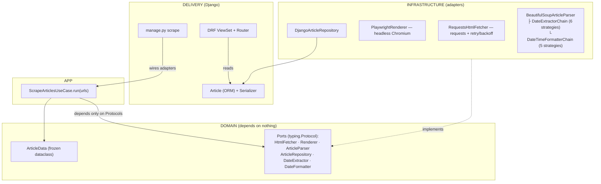
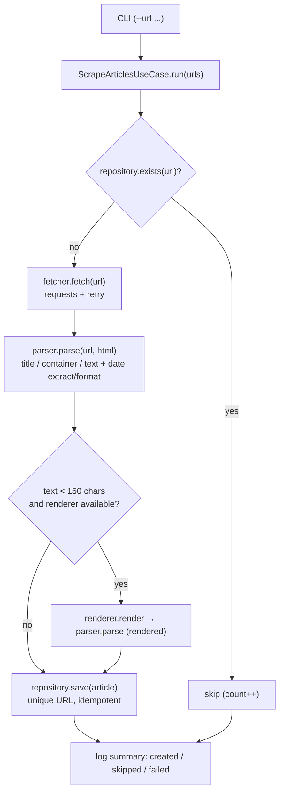

# 📰 Django Article Scraper

> A **Django + Django REST Framework** service that scrapes news/blog articles from arbitrary
> URLs, normalizes their **title, content and publication date**, persists them in
> **PostgreSQL**, and exposes them through a read-only **JSON REST API** — built on a
> Hexagonal (Ports & Adapters) core with a bilingual (PL/EN) date-resolution engine.

<p>
  
  
  
  
  
  
  
</p>

What sets this project apart from a typical "scraper tutorial" is its **architecture and its date
engine**: it is built with a **Hexagonal (Ports & Adapters) / Clean Architecture** layout, and the
publication-date resolution is a two-stage **Chain-of-Responsibility + Strategy** pipeline that
understands **absolute, ISO-8601 and relative dates in both Polish and English** (`"3 godziny temu"`,
`"2 weeks ago"`, `"wczoraj o 13:00"`, `"today at 9"`, …). When a page is JavaScript-rendered and the
plain HTTP fetch returns too little text, it transparently **falls back to a headless Playwright
browser**.

---

## 📑 Table of Contents

1. [Purpose](#-purpose)
2. [Main Features](#-main-features)
3. [Tech Stack](#-tech-stack)
4. [Architecture](#-architecture)
5. [Project Structure](#-project-structure)
6. [Workflow](#-workflow)
7. [The Date Engine (deep dive)](#-the-date-engine-deep-dive)
8. [Quickstart](#-quickstart)
9. [Configuration](#-configuration)
10. [API Reference](#-api-reference)
11. [Testing](#-testing)
12. [Docker](#-docker)

---

## 🎯 Purpose

Aggregate articles from heterogeneous websites into a single, queryable store. Each source uses a
different HTML structure and a different way of expressing "when was this published", so the core
engineering problem the project solves is **robust, source-agnostic extraction** — especially of the
**publication date**, which is the hardest field to normalize across real-world pages.

Typical use cases: building a press-monitoring dataset, a content index, or a research corpus.

---

## ✨ Main Features

| Feature | Description |
|---|---|
| **Source-agnostic scraping** | Works against any URL; title/content/date are discovered heuristically rather than hard-coded per site. |
| **Two-stage date resolution** | An **extractor chain** pulls the raw date string out of the DOM; a **formatter chain** turns it into a timezone-aware `datetime`. |
| **Bilingual relative dates (PL/EN)** | Understands `"5 minut temu"`, `"sprzed 3 dni"`, `"2 hours ago"`, `"last night"`, `"dziś o 15:45"`, and more. |
| **JS-render fallback** | If the static HTML yields `< 150` chars of text, it re-fetches via **headless Playwright (Chromium)**. |
| **Resilient HTTP** | `requests.Session` with `urllib3` retry/back-off on `429/5xx` and a request timeout. |
| **Idempotent ingestion** | Unique-URL constraint + `exists()` pre-check → re-running the scraper skips already-stored articles. |
| **Read-only REST API** | DRF `ReadOnlyModelViewSet` with list, detail and `?source=<domain>` filtering. |
| **Batch CLI** | `python manage.py scrape --url ... --url ...` (falls back to a curated default URL set). |
| **Observability** | Structured, leveled logging to console **and** file across every stage. |
| **Container-ready** | `Dockerfile` + `docker-compose` (Postgres healthcheck, gunicorn web, on-demand scraper profile). |

---

## 🧰 Tech Stack

**Language & Runtime**
- Python **3.11+** (README) / **3.12-slim** (Docker image)

**Web / API**
- **Django 5.2.7** — application framework, ORM, admin, management commands
- **Django REST Framework 3.16.1** — serialization + routed read-only API
- **gunicorn** — WSGI application server (production)
- **whitenoise** — compressed/manifested static-file serving

**Persistence**
- **PostgreSQL** (16-alpine in Compose; 13+ per README)
- **psycopg[binary] 3.2.10** — Postgres driver
- **dj-database-url 3.0.1** — `DATABASE_URL` parsing

**Scraping & Parsing**
- **requests 2.32.5** + **urllib3 2.5.0** (`Retry`/`HTTPAdapter`)
- **BeautifulSoup4 4.14.2** (`html.parser`)
- **Playwright 1.55.0** (Chromium, headless) — JS-render fallback

**Date Handling**
- **dateparser 1.2.2** + **pytz 2025.2** + a hand-rolled regex engine

**Config / Tooling**
- **python-dotenv 1.1.1** — `.env` loading
- **Docker** / **docker-compose**
- **pytest** + **freezegun** — tests (see [Testing](#-testing) for a packaging caveat)
- JetBrains IDE project files present (`.idea/`)

**Design Patterns**
- Hexagonal / Ports & Adapters · Chain of Responsibility · Strategy · Repository · Constructor Dependency Injection · `typing.Protocol` structural interfaces

---

## 🏛 Architecture

The code follows **Clean / Hexagonal Architecture**: the business logic (`domain`, `app`) has **no
dependency on Django, HTTP or BeautifulSoup**. Those live in `infrastructure` and are injected in at
the edge (the management command). Interfaces are declared as `typing.Protocol` "ports".



**Ports (`scraper/domain/ports.py`)** — `HtmlFetcher`, `Renderer`, `ArticleParser`,
`ArticleRepository`, `DateExtractor`, `DateFormatter`.

**Dependency rule** — arrows point inward: `infrastructure` and `delivery` depend on `domain`;
`domain` depends on nothing. The use case receives its collaborators via the constructor, so any
adapter (e.g. the fetcher or repository) can be swapped or mocked without touching business logic.

---

## 🗂 Project Structure

```
article_scraper-master/
├── article_scraper/              # Django project (settings, urls, wsgi/asgi)
├── scraper/                      # The application
│   ├── domain/
│   │   ├── models.py             # ArticleData (frozen dataclass)
│   │   └── ports.py              # Protocol interfaces (the "ports")
│   ├── app/
│   │   └── use_cases.py          # ScrapeArticlesUseCase (orchestration)
│   ├── infrastructure/
│   │   ├── request_html_fetcher.py   # requests + retry/backoff
│   │   ├── playwright_renderer.py    # headless Chromium fallback
│   │   ├── repository.py             # DjangoArticleRepository (adapter)
│   │   └── parsing/
│   │       ├── parser.py             # BeautifulSoupArticleParser + chain builders
│   │       ├── parsing_utils.py      # title/container selection, html→text
│   │       └── date/
│   │           ├── const.py          # PL months, regexes, TZ
│   │           ├── extract/          # 6 date-EXTRACTION strategies + chain
│   │           └── formate/          # 5 date-FORMATTING strategies + chain
│   ├── management/commands/scrape.py # CLI entry point (wires the graph)
│   ├── models.py                 # Article ORM model + ArticleSerializer
│   ├── views.py                  # ArticleViewSet (read-only)
│   ├── admin.py                  # Article registered in Django admin
│   └── migrations/               # 3 migrations (note the date-field evolution)
├── tests/formate/                # pytest: unit + integration for the date engine
├── docker/entrypoint.sh          # wait-for-db + optional collectstatic
├── docker-compose.yml            # db (healthcheck) + web (gunicorn) + scraper (profile)
├── dockerfile                    # python:3.12-slim + Playwright chromium
├── requirements.txt
└── README.md                     # project readme
```

---

## 🔄 Workflow

### Scraping pipeline (`manage.py scrape`)



Per-URL failures are caught and counted (`HTTPError` and generic `Exception`) so **one bad URL never
aborts the batch**.

### Read pipeline (API)

`GET /articles/` → DRF `ReadOnlyModelViewSet` → `ArticleSerializer` → JSON. Optional
`?source=<domain>` applies a case-insensitive `url__icontains` filter; `source` itself is derived at
serialization time from the URL's netloc.

---

## 🧠 The Date Engine (deep dive)

Publication date is resolved in **two independent, ordered chains**. Each strategy is small,
single-purpose and independently unit-tested.

### 1. Extraction chain — *"find the raw date text"* (`build_default_date_extractor_chain`)

Tried in order; **first non-empty match wins**:

1. `MetaDateExtractor` — `<meta property="article:published_time">`, `og:published_time`, `itemprop=datePublished`, `pubdate`, …
2. `TimeTagDateExtractor` — `<time datetime="…">` (or its text)
3. `ClassBasedDateExtractor` — elements matching `[class*="date"]`, `[class*="time"]`, `.post-meta`, `.entry-meta`
4. `RegexFallbackDateExtractor` — `dd.mm.yyyy` or Polish worded dates (`2 stycznia 2024`) anywhere in the text
5. `RelativeEnTextDateExtractor` — English relative phrases
6. `RelativePlTextDateExtractor` — Polish relative phrases

### 2. Formatting chain — *"turn text into a `datetime`"* (`build_datetime_formatter_chain`)

1. `ISO8601ZFormatter` — strict ISO-8601 with `Z`/offset
2. `SmartFormatter` — `dateparser` (Polish locale, prefers past dates, TZ-aware)
3. `PolishHardFormatter` — numeric `dd.mm.yyyy` and worded Polish dates with optional time
4. `RelativePlFormatter` — Polish relative → absolute (`temu`, `sprzed`, `wczoraj o …`)
5. `RelativeEnFormatter` — English relative → absolute (`ago`, `yesterday at …`, `this morning`)

The chain output is normalized to **Europe/Warsaw** and midnight-collapsed when no time is present
(`set_timezone`). Relative-phrase heuristics are explicit (e.g. *this morning* → 09:00, *last night*
→ 23:00, *1 month ago* → −30 days, *1 year ago* → −365 days).

> **Known correctness caveat:** the relative formatters compute `now = datetime.utcnow()` (a *naive
> UTC* value) and later localize it as Europe/Warsaw. That conflates UTC with local time, so
> relative results can be off by the UTC offset (1–2 h) in production. The unit tests don't catch it
> because `freezegun` freezes `utcnow()` and assertions check internal consistency rather than the
> real-world instant.

---

## 🚀 Quickstart

### Local (venv)

```bash
git clone <repository-url>
cd article_scraper-master

python -m venv .venv
source .venv/bin/activate           # Windows: .venv\Scripts\activate
pip install --upgrade pip
pip install -r requirements.txt
playwright install chromium          # required for the JS-render fallback
```

Create a `.env` in the project root (see [Configuration](#-configuration)), then:

```bash
python manage.py migrate
python manage.py runserver           # http://127.0.0.1:8000/
```

Scrape (defaults to a built-in URL set if `--url` is omitted):

```bash
python manage.py scrape --url https://example.com/article-1 --url https://example.com/article-2
```

---

## ⚙️ Configuration

Loaded from `.env` via `python-dotenv`. Two DB configuration modes are supported:

| Variable | Purpose |
|---|---|
| `DATABASE_URL` | If set, parsed by `dj-database-url` (takes precedence). |
| `DB_NAME` / `DB_USER` / `DB_PASSWORD` / `DB_HOST` / `DB_PORT` | Discrete Postgres settings (fallback mode). |
| `DJANGO_SECRET_KEY` (or `SECRET_KEY`) | Django secret key. |
| `REQUEST_TIMEOUT_SECONDS` | HTTP fetch timeout (default `10`). |

Generate a secret key:

```bash
python -c "from django.core.management.utils import get_random_secret_key as g; print(g())"
```

> ⚠️ `DEBUG` is currently **hard-coded to `True`** in `settings.py` and overrides the (unused)
> env-derived value. This must be fixed before any real deployment.

---

## 📡 API Reference

Router is mounted at the site root, so the resource lives at `/articles/`.

| Method | Endpoint | Description |
|---|---|---|
| `GET` | `/articles/` | List all stored articles |
| `GET` | `/articles/<id>/` | Retrieve one article by primary key |
| `GET` | `/articles/?source=<domain>` | Filter by source domain (`url__icontains`) |
| `GET` | `/admin/` | Django admin (articles registered) |

**Actual serialized fields:** `url`, `title`, `content`, `cleaned_content`, `date`, `source`
(the last is derived from the URL's netloc).

```jsonc
// GET /articles/?source=bbc.com
[
  {
    "url": "https://www.bbc.com/news/example-article",
    "title": "Example headline",
    "content": "<article>…raw HTML…</article>",
    "cleaned_content": "…plain text…",
    "date": "2025-10-18T10:00:00+02:00",
    "source": "www.bbc.com"
  }
]
```

---

## 🧪 Testing

The test suite (`tests/formate/`) covers the **date engine** — the riskiest part of the codebase —
with both unit tests (per strategy) and an integration test (full formatter chain), using
`pytest` + `freezegun` for deterministic "now".

```bash
pip install pytest freezegun    # not currently pinned in requirements.txt
pytest tests/
```

**Caveat:** `pytest` and `freezegun` are **not listed in `requirements.txt`**, and there is no
`pytest.ini` / `pyproject.toml` / `conftest.py` wiring `pytest-django`. The date tests import no ORM
and therefore run as plain pytest, but the missing pins hurt reproducibility. There are currently
**no tests** for the use case, HTTP fetcher, parser, repository or API layer.

---

## 🐳 Docker

```bash
docker compose up --build            # Postgres + web (gunicorn on :8000)
docker compose run --rm scraper --url <url1> <url2>   # on-demand scrape (profile)
docker compose down
```

- **db** — `postgres:16-alpine`, Polish locale, `pg_isready` healthcheck.
- **web** — builds the image, runs `migrate` then `gunicorn` (3 workers).
- **scraper** — same image, gated behind the `scrape` Compose profile for on-demand runs.
- The image installs **Playwright Chromium with system deps**; `entrypoint.sh` waits for Postgres
  (parsing host/port out of `DATABASE_URL`) before exec-ing the command.
